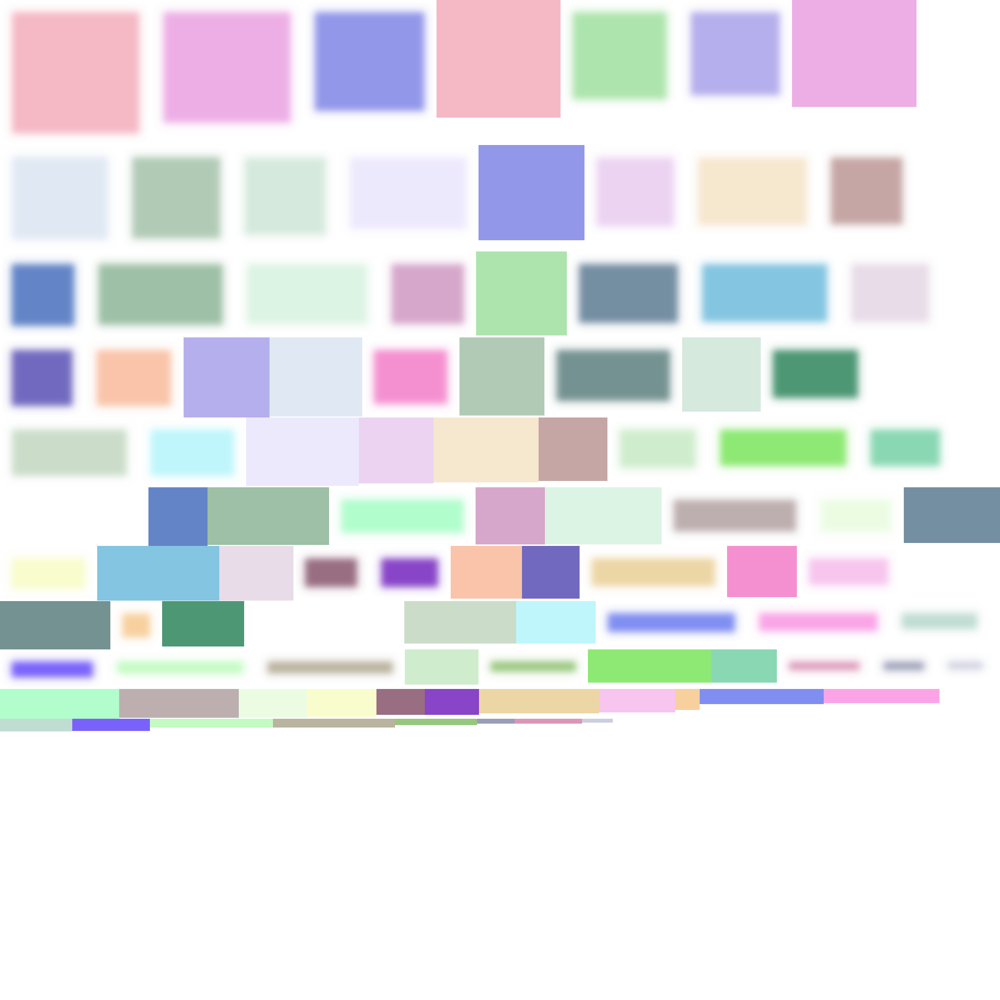

# texture-packer
[](https://semver.org/)
[](https://svgshare.com/i/Zhy.svg)
[](https://svgshare.com/i/ZhY.svg)
[](https://www.rust-lang.org/)
[](https://lbesson.mit-license.org/)



A CLI tool used to generate texture atlases for graphics applications such as GUI, video games and so on to improve performance of these applications.

## Table of contents
- [Usage](https://github.com/ii887522/texture-packer#usage)
- [Prerequisites](https://github.com/ii887522/texture-packer#prerequisites)
- [Format the project](https://github.com/ii887522/texture-packer#format-the-project)
- [Automatically format the project on change](https://github.com/ii887522/texture-packer#automatically-format-the-project-on-change)
- [Lint the project](https://github.com/ii887522/texture-packer#lint-the-project)
- [Automatically lint the project on change](https://github.com/ii887522/texture-packer#automatically-lint-the-project-on-change)
- [Build the vcpkg dependencies in the project](https://github.com/ii887522/texture-packer#build-the-vcpkg-dependencies-in-the-project)
- [Build the project](https://github.com/ii887522/texture-packer#build-the-project)
- [Automatically build the project on change](https://github.com/ii887522/texture-packer#automatically-build-the-project-on-change)
- [Test the project](https://github.com/ii887522/texture-packer#test-the-project)
- [Automatically test the project on change](https://github.com/ii887522/texture-packer#automatically-test-the-project-on-change)
- [Run the project](https://github.com/ii887522/texture-packer#run-the-project)

## Usage
```
texture-packer <input-dir-path> <output-dir-path>
```
`input-dir-path` is an input directory path where the directory is located optionally contains a list of images that will become parts of a texture atlas.

The input directory given also optionally contains a `blur.toml` file that contains a variable called `img_file_names` which is an array of strings that selects the images in the input directory to be used to generate their blur variants. Each entry in `img_file_names` array is a relative file path to the image.

`blur.toml` also optionally contains a variable called `rects` which is a TOML table. Each entry in the TOML table has a key of type string that denotes the name of the white rectangle. No nested keys are allowed in the `rects` TOML table. Each entry in the TOML table also have a value comprises variables `w` and `h` that are width and height of the rectangle respectively. Both `w` and `h` variables must be integers and greater than 0.

`output-dir-path` is an output directory path where the directory is located contains a generated texture atlas file and a texture region reference file in TOML format. Each texture region reference inside the TOML file points to a small area of the texture atlas. That small area is actually an image (rotated or not) which comes from the input directory.

## Prerequisites
- Windows 11 or Linux
- [Visual Studio Code](https://code.visualstudio.com/) with plugins:
  - Better TOML
  - CodeLLDB
  - EditorConfig for VS Code
  - GLSL Lint
  - Markdown All in One
  - rust-analyzer
  - Shader languages support for VS Code
  - YAML
- [Rust 1.61.0](https://www.rust-lang.org/) and later
- [rustfmt 1.4.38](https://github.com/rust-lang/rustfmt) and later
- [clippy 0.1.60](https://github.com/rust-lang/rust-clippy) and later
- [cargo-watch 8.1.1](https://github.com/watchexec/cargo-watch) and later
- [cargo-vcpkg 0.1.6](https://crates.io/crates/cargo-vcpkg) and later

## Format the project
```sh
cargo fmt
```

## Automatically format the project on change
```sh
cargo watch -x fmt
```

## Lint the project
```sh
cargo clippy --all-features
```

## Automatically lint the project on change
```sh
cargo watch -x "clippy --all-features"
```

## Build vcpkg dependencies in the project
```sh
cargo vcpkg build
```

## Build the project
```sh
cargo build
```

## Automatically build the project on change
```sh
cargo watch -x build
```

## Test the project
```sh
cargo test
```

## Automatically test the project on change
```sh
cargo watch -x test
```

## Run the project
```sh
cargo run
```
